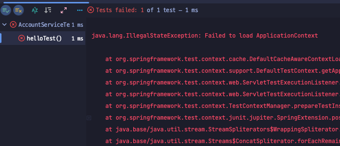
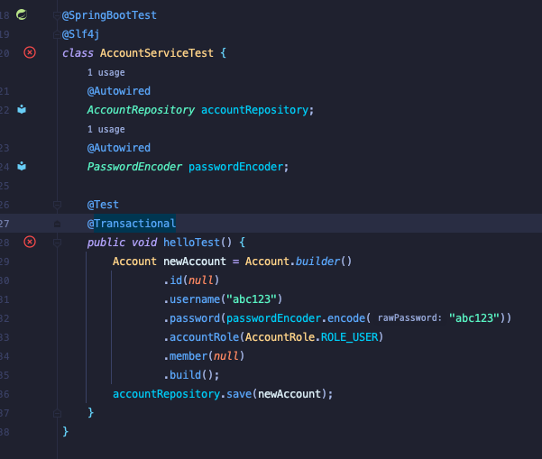

## 문제 발단
기본적인 코드를 작성한 뒤 Test를 해야할 일이 생겨 간단한 코드를 작성 후 돌려봤는데 아래와 같은 에러를 마주치게 되었다.<br>

`java.lang.IllegalStateException: Failed to load ApplicationContext`



## 에러 코드
테스트로 작성한 코드는 아래와 같다.



정말 뭐 문제될게 없어 보여서 구글링하며 열심히 찾아봤더니 아래와 같은 어노테이션을 붙이라는 글을 보았다.

```java
@RunWith(SpringRunner.class)
@WebAppConfiguration
```

큰 기대감과 함께 작성해보았지만 당연히 같은 에러가 반복해서 떴다.<br>
어떤 문제인지 살펴보고자 에러 코드를 분석했는데 그 중에서 아래와 같은 문구를 발견했다.

```bash
Caused by: java.lang.ClassNotFoundException: org.springframework.jdbc.support.JdbcTransactionManager
```

이 구문을 검색해 중국 커뮤니티에서 이에 대한 이슈를 다루고 있어 해결 방법을 찾을 수 있었다.

```java
// 변경 전 build.gradle
dependencies {
    implementation group: 'org.springframework', name: 'spring-jdbc', version: '5.2.3.RELEASE'
}
```

```java
// 변경 후 build.gradle
dependencies {
	implementation group: 'org.springframework', name: 'spring-jdbc', version: '5.3.4'
}
```

`spring-jdbc` 의 버전 문제라 상위 버전으로 올려주니 말끔히 해결되었다 !

> 앞으로 에러가 발생하면 가장 위에 있는 구문을 검색해보는 것도 좋지만 중간에 발생한 문제부터 해결해보는 습관을 가져야할 것 같다.

( `#Spring Boot Test Error` ,  `#Junit Test Error` )