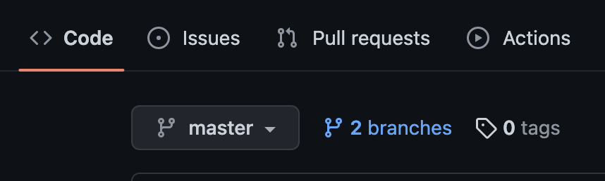
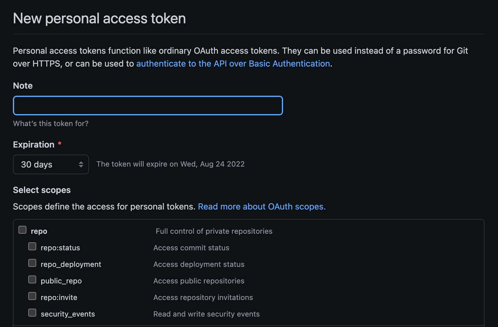
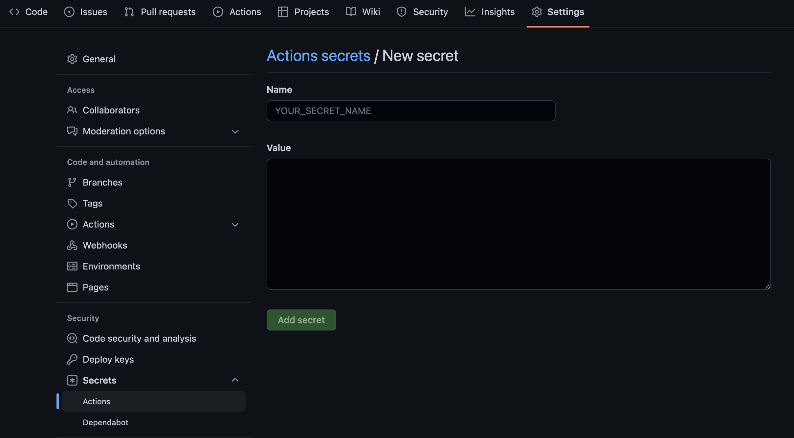
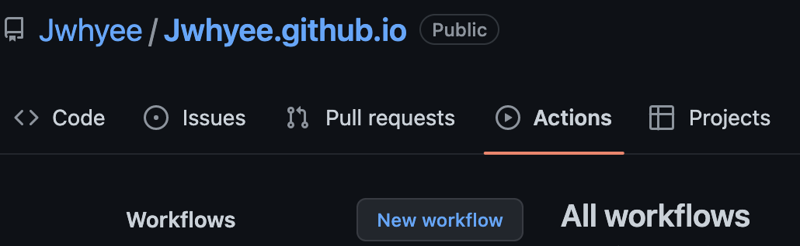
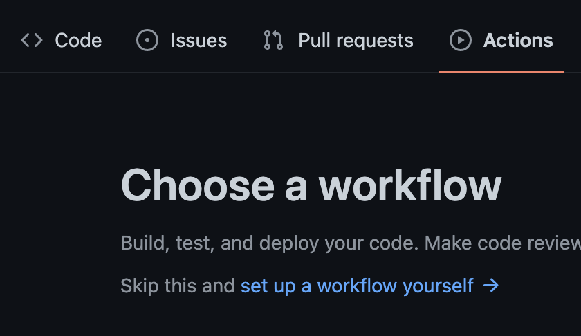
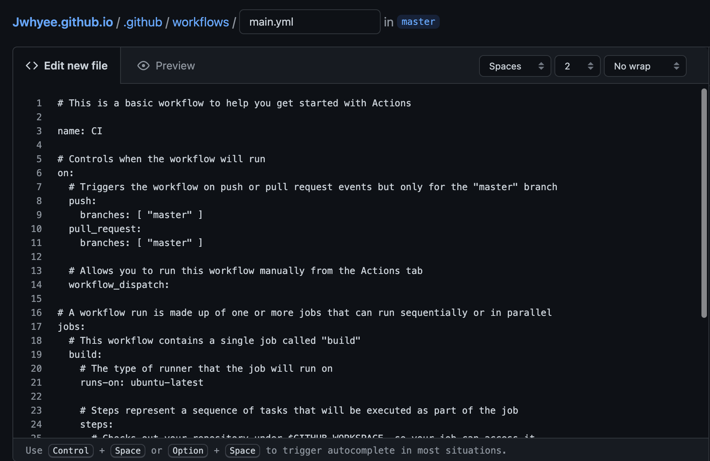
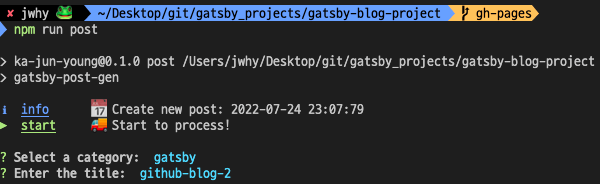
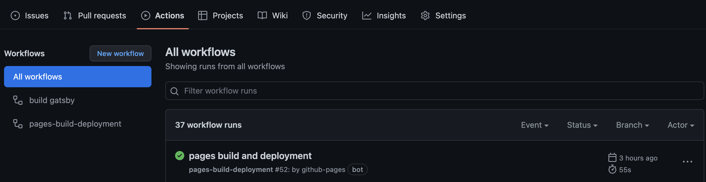

## Gatsby Blog
이전 [포스트](https://jwhyee.github.io/GATSBY/github-blog-1)에서는 Gatsby 설치와 로컬에서 페이지를 여는 것을 다뤘으니, 이번에는 Github Pages를 이용해 배포하는 것을 목표로 진행해보자!

## ⚙️　**Setting**
### 🚀　**Add gatsby-post-gen**
우선 파일을 쉽게 작성하기 위한 `gatsby-post-gen` 을 설치해준다.
```sh
npm install -D gatsby-post-gen
```
`package.json` 파일에 `create` 에 대한 내용을 추가해준다.
```sh
"scripts": {
  "create": "gatsby-post-gen",
}
```

### 🚀　**Add Deploy**
`package.json` 파일에 `deploy` 에 대한 내용을 추가해준다.
> **⛔️　주의 : 본인의 `main` 브랜치가 `master` 인지 `main` 인지 잘 확인하고 진행하자!**<br>

```
"scripts": {
    "deploy": "gatsby build && gh-pages -d public -b master -r 'git@github.com:${Github-username}/${Github-Repository-Name}.github.io.git'"
}
```
### 🚀　**Github Setting**
프로젝트 `Repository` 에 `gh-pages` 라는 브랜치를 생성해준다.



앞으로 master 브랜치에서는 
이전 포스트에서 진행한 방식대로 `VS Code` 에서 명령어를 입력하는 방식으로 하겠다.<br>
이제 `VS Code` 로 돌아와서 `터미널` 에 아래 구문을 진행해준다.
```sh
git fetch
git checkout gh-pages
npm i --save-dev gh-pages
```
> 이제 `master(main)` 브랜치는 배포용 파일이 저장되고, 내가 올릴 파일들은 `gh-pages` 브랜치에서 관리한다.<br>
> 설치가 완료된다면 아래 명령어를 실행해서 배포를 해준다.

```sh
npm run deploy
```

## 👨‍💻　**Github Actions**
배포를 완료했다면 `Github Actions` 를 활용하여 자동화해주자!<br>
> 아까 생성한 `gh-pages` 에서는 블로그 글을 작성해주고 `push` 해주면 자동으로 `master(main)` 브랜치에 적용되어서 배포된다.
### 🚀　**Generate New Token**
해당 [깃허브 토큰 생성](https://github.com/settings/tokens) 링크에 들어가서 `Generate New Token` 을 클릭해 새로운 토큰을 생성해준다.



Note에는 알아보기 쉽게 **GATSBY-BLOG-TOKEN**으로 작성해주었다.(이름은 자유)<br>
`Select scopes` 에는 모두 체크를 해준다.<br>
`Token` 이 생성되면 초록색 부분에 `key` 가 나올 것이다. 이를 복사해두자!

### 🚀　**Import Token**
이제 프로젝트 `Repository` 로 돌아와 `Setting -> Secerets -> Actions` 로 들어가준다.<br>
여기에 `New repository secret` 을 눌러 아까 복사한 내용을 `Value` 에 넣어준다.<br>
`Name` 에는 `GITBLOG` 라고 작성했다.(이름은 자유)



### 🚀　**New workflow**
이제 새로운 `workflow` 를 생성해서 배포를 자동화시키면 끝이다!<br>
**Repository**에 **Actions**를 누르면 아래와 같은 화면이 나올 것이다.<br>
여기서 **New workflow**를 클릭하고, **set up a workflow yourself**를 눌러준다.




그럼 아래와 같은 화면이 나오는데 아래로 대체해주고 **Start Commit**을 눌러준다.<br>
여기도 동일하게 **master**와 **main**을 구분해서 작성해준다!



> 사진에 있는 코드는 이전 버전이니 아래 있는 코드로 작성해주세요!
> 2022년 8월 26일 업데이트

```shell
on:
  push:
    branches:
      - gh-pages

jobs:
  deploy:
    runs-on: ubuntu-20.04
    steps:
      - uses: actions/checkout@v2

      - name: Setup Node
        uses: actions/setup-node@v1
        with:
          node-version: '10.x'

      - name: Cache dependencies
        uses: actions/cache@v1
        with:
          path: ~/.npm
          key: ${{ runner.os }}-node-${{ hashFiles('**/package-lock.json') }}
          restore-keys: |
            ${{ runner.os }}-node-
      - run: npm ci
      - run: npm run format
      - run: npm run test
      - run: npm run build

      - name: Deploy
        uses: peaceiris/actions-gh-pages@v3
        with:
          github_token: ${{ secrets.GITHUB_TOKEN }}
          # github_token: ${{ secrets.GITHUB_TOKEN }}
          publish_dir: ./public
          publish_branch: master  # deploying branch
```
### Waiting for a runner to pick up this job
위 구문이 뜨고 무한 대기에 빠진다면  `ubuntu-latest` 혹은 `ubuntu-18.04`로 바꿔보면 해결 될 것이다.<br>
> ubuntu-18.04은 deprecated 되었으니 가능하면 쓰지 않는 것이 좋다.

## 📝　**New Post**
모든 과정을 완료 했으니 VS Code로 돌아와서 터미널에 `npm run post`를 입력해보자!<br>
category를 설정하고 새로운 글을 작성해보자!



글을 다 작성했으면 아래 구문을 터미널에 입력해보자!
```sh
git add .
git commit -m "create new post"
git push origin gh-pages
```
다 입력했다면 Repository Actions에서 새로운 **workflow**가 실행되는지 확인해보자!



## 📎　**Google Search Console**
[검색 엔진 노출](https://sasumpi123.github.io/general/gitblog4/)
