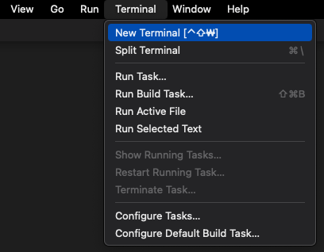
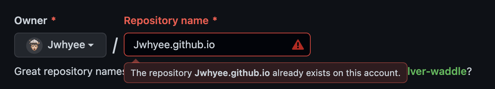

## Gatsby Blog
항상 배운 내용들을 Notion에 정리하곤 했다.</br>
하지만 Notion의 문제점은 다른 사람들에게 공유하기 어렵다는 단점이 있다.</br>
그렇게 잔디심기와 외부에 노출이 가능한 블로그를 만들어보기로 했다.

## **Gatsby 설치**
그냥 아무 템플릿을 이용할 수 있지만 가장 깔끔해보였던 재엽님의 [gatsby-starter-bee](https://github.com/JaeYeopHan/gatsby-starter-bee)를 사용해보기로 했다.<br>

### 🚀　**Install Gatsby**
```sh
npm install gatsby-cli
```

### 🚀　**Install Project**
이제 내가 설치할 폴더로 경로를 이동해서 해당 폴더에 설치해준다.<br>
아래 `my-blog-starter` 는 본인의 취향대로 변경해줘도 무관하다!
```sh
gatsby new my-blog-starter https://github.com/JaeYeopHan/gatsby-starter-bee
```
### ❓　**Exception**
위에 구문을 터미널에서 실행을 했을 때 에러가 나면 현재 Node 버전을 확인해본다.<br>
```sh
node -v
```
현재 `gatsby-starter-bee` 는 `Node 14` 버전까지 지원하기 때문에 버전을 낮춰준 뒤 다시 시도한다. **노드 버전 변경**은 해당 [블로그](https://velog.io/@zlemzlem5656/node-version-변경하기)를 참고하자!


### 🚀　**Visual Studio Code 연결**
1. **VS Code**를 열어서 `command + shift + N` 을 눌러 새로운 창을 킨다.
2. **Open**을 눌러서 프로젝트 폴더를 열어준다.
3. 아래 스크린샷과 같이 `New Terminal`을 클릭해서 새로운 터미널 창을 열어준다.<br>
(앞으로 모든 터미널 명령어는 `VS Code` 터미널에서 입력해준다.)
<br>



## **Github 설정**
이제 깃허브 블로그를 만들기 위해 아래 과정을 진행해준다.<br>
**(필자는 기존에 `Repository` 를 만들었기 때문에 빨간색으로 뜬다.)**
### 🚀　**Repository 생성**


### 🚀　**Git 연결**
아까 생성한 **my-blog-starter**로 이동해서 **git**을 연결해준다.<br>
**(아래 `${value}` 부분은  `${}` 를 제거하고 입력해야한다.)**<br>
> **⛔️　주의 : 본인의 `main` 브랜치가 `master` 인지 `main` 인지 잘 확인하고 진행하자!**

```sh{5}
cd my-blog-starter
rm -rf .git
rm -rf package-lock.json
git init
git add .
git commit -m "new project"
gir remote add origin https://github.com/${Github-username}/${Github-Repository-Name}.github.io
git push -u origin master
```
이제 본인의 `Guthub Repository`에 들어갔을 때 파일이 잘 들어갔으면 성공이다!

## 🎨　**블로그 커스텀**
[gatsby-starter-bee](https://github.com/JaeYeopHan/gatsby-starter-bee)를 들어가보면 `Customize` 부분에 블로그 설정하는 방법이 나온다.<br>
우선 기본 정보를 수정하기 위해서는 `gatsby-meta-config.js`를 수정해준다.

## 🖥　**확인해보기**
```sh
npm start
```
아래와 같은 구문이 나오면 성공이다!
```shell
You can now view ka-jun-young in the browser.
⠀
  http://localhost:8000/
⠀
View GraphiQL, an in-browser IDE, to explore your site's data and schema
⠀
  http://localhost:8000/___graphql
⠀
```
## **깃허브 배포**
이후 내용은 다음 [포스트](https://jwhyee.github.io/GATSBY/github-blog-2)에서 다루도록 하겠다.

### 참고 블로그
- https://github.com/JaeYeopHan/gatsby-starter-bee
- https://github.com/JaeYeopHan/gatsby-starter-bee/issues/52
- https://codepathfinder.com/entry/NVM-Nodejs-버전-변경하기
- https://velog.io/@gparkkii/build-gatsby-blog2
- https://programmer-eun.tistory.com/99